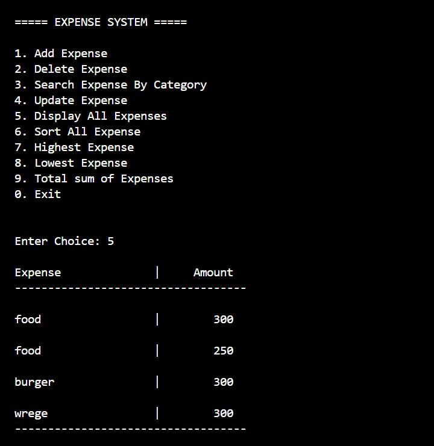
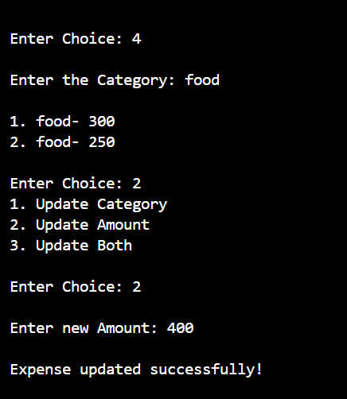
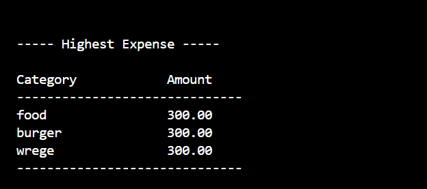
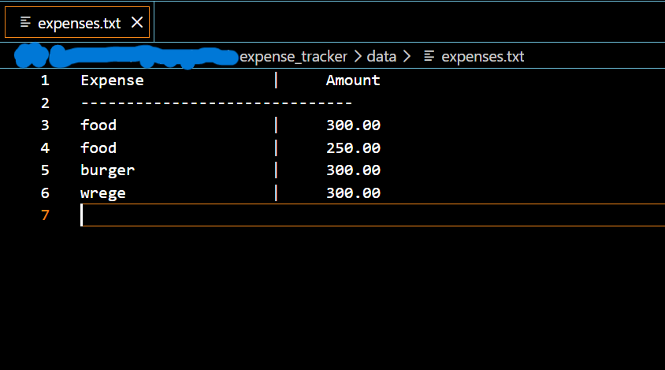

# Expense Tracker System

A robust, object-oriented Command Line Interface (CLI) application built in C++ designed to manage daily expenses efficiently. The system persistently stores records in a text file, automatically manages file system configurations, and handles complex operational edge cases like duplicate categories seamlessly.

---

## 🚀 Features

- **Persistent Storage:** Data is saved securely inside a localized text file (`data/expenses.txt`).
- **Self-Repairing Directory:** Automatically creates the required folders and files if they do not exist on launch.
- **Smart Update & Delete:** If multiple expenses share the same category, the system prompts you to choose the exact entry to modify or remove.
- **Flexible Sorting:** Sort your expense history by amount (ascending/descending) or alphabetically (A–Z / Z–A) by category.
- **Financial Analytics:** View statistics including highest expense, lowest expense, and total expenditures.

---

## 📷 Screenshots

### Main Menu & Overview


### Displaying All Current Expenses



### Intelligent Expense Updating

*Handles multiple entries under the same category safely.*



### Highest Expense Filter



### Underlying Text Database Storage (`data/expenses.txt`)



---

## 🛠️ Installation & Setup

### Prerequisites

Make sure you have a C++ compiler installed (such as `g++`).

### Build and Run

Open a terminal in the project's root directory.

#### Compile

```bash
g++ src/main.cpp src/expense.cpp src/expense_manager.cpp src/file_manager.cpp -o build/main
```

#### Run

```bash
build/main
```

> 📁 **Note:** The application automatically creates the `data/` folder and `expenses.txt` file during its first launch. No manual setup is required.

---

## 📁 Project Directory Structure

```text
expense_tracker/
├── build/
│   └── main
├── data/
│   └── expenses.txt
├── pics/
│   ├── main menu.png
│   ├── displayingExpenses.png
│   ├── updateExpense.png
│   ├── highestExpense.png
│   └── txtFile.png
└── src/
    ├── expense_manager.cpp
    ├── expense_manager.h
    ├── expense.cpp
    ├── expense.h
    ├── file_manager.cpp
    ├── file_manager.h
    ├── input_utils.h
    └── main.cpp
```
